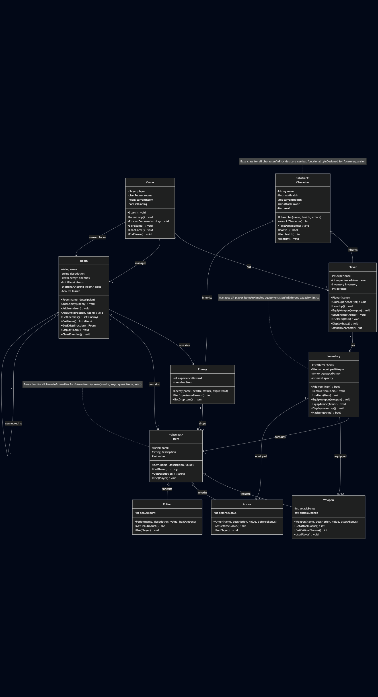

# Dungeon Crawler

A text-based dungeon crawler RPG built in C# to demonstrate Object-Oriented Programming principles and software design with UML.


*[Add screenshot of your game in action]*

## 🎮 About The Project

This project was created as a learning exercise to practice:
- Object-Oriented Programming (OOP) concepts
- UML diagram creation and design-first development
- C# language fundamentals
- Software architecture and design patterns

The game features a classic dungeon crawler experience where players explore rooms, fight enemies, collect loot, level up, and save their progress.

## ✨ Features

- **Turn-based Combat System**: Strategic battles with enemies
- **Character Progression**: Gain experience, level up, and grow stronger
- **Inventory Management**: Collect items, potions, weapons, and armor
- **Equipment System**: Equip weapons and armor to boost your stats
- **Multiple Rooms**: Explore an interconnected dungeon
- **Save/Load System**: Save your progress and continue later
- **Extensible Design**: Built to easily add new features like critical hits, special abilities, and status effects

## 🏗️ Architecture

This project follows Object-Oriented Design principles with a clear separation of concerns:

### Class Hierarchy
- **Character** (Abstract Base)
  - Player
  - Enemy
- **Item** (Abstract Base)
  - Weapon
  - Armor
  - Potion
- **Game** (Controller)
- **Room** (World)
- **Inventory** (System)

### UML Class Diagram


*Full design documentation available in [DesignDocument.md](design/DesignDocument.md)*

## 🛠️ Technologies Used

- **Language**: C# (.NET 8.0)
- **IDE**: Visual Studio 2022
- **Serialization**: System.Text.Json (for save/load)
- **Design**: UML (Mermaid.js for diagrams)

## 🚀 Getting Started

### Prerequisites
- .NET SDK 8.0 or higher
- Visual Studio 2022 (or VS Code with C# extension)

### Installation

1. Clone the repository
```bash
git clone https://github.com/yourusername/DungeonCrawler.git
cd DungeonCrawler
```

2. Open the solution
```bash
cd src
dotnet restore
```

3. Build and run
```bash
dotnet run --project DungeonCrawler
```

### How to Play

#### Commands
- `look` - View current room details
- `move [direction]` - Move to another room (north, south, east, west)
- `attack` - Fight enemies in the current room
- `take [item]` - Pick up an item
- `use [item]` - Use an item from your inventory
- `equip [item]` - Equip a weapon or armor
- `inventory` - View your items
- `stats` - View your character stats
- `save` - Save your game
- `help` - Display all commands
- `quit` - Exit the game

#### Tips
- Always check your HP before engaging in combat
- Equip better weapons and armor as you find them
- Use potions wisely - they're consumed when used
- Explore all rooms to find the best loot
- Save frequently!

## 📊 Project Structure

```
DungeonCrawler/
├── docs/
│   ├── diagrams/          # UML diagrams and flowcharts
│   └── screenshots/       # Game screenshots
├── design/
│   ├── DesignDocument.md  # Complete design specification
│   ├── Pseudocode.md      # Algorithm pseudocode
│   └── ImplementationGuide.md
├── src/
│   └── DungeonCrawler/    # C# source code
│       ├── Characters/    # Character classes
│       ├── Items/         # Item hierarchy
│       ├── World/         # Room class
│       ├── Systems/       # Inventory system
│       └── Utilities/     # Save/load, UI helpers
└── saves/                 # Save game files
```

## 🎯 What I Learned

### Object-Oriented Programming
- **Inheritance**: Character base class with Player and Enemy subclasses
- **Polymorphism**: Item base class with different item types (Weapon, Armor, Potion)
- **Encapsulation**: Private fields with public methods for controlled access
- **Abstraction**: Abstract classes defining contracts for subclasses

### Design Patterns
- **Template Method**: Character's attack logic used by Player and Enemy
- **Strategy Pattern**: Different item types implement unique behavior
- **Singleton**: Game instance management

### Software Engineering
- **UML Diagrams**: Created class diagrams and flowcharts before coding
- **Design-First Approach**: Planned architecture before implementation
- **Iterative Development**: Built in phases, testing each component
- **Code Organization**: Separated concerns into logical namespaces

### C# Specific Skills
- Access modifiers (public, private, protected)
- Properties vs fields
- Abstract classes and virtual methods
- Collections (List<T>, Dictionary<TKey, TValue>)
- File I/O and JSON serialization
- Exception handling

## 🔮 Future Enhancements

- [ ] Critical hit system with animations
- [ ] Special abilities and skills
- [ ] Status effects (poison, burn, stun)
- [ ] Magic system with spells and mana
- [ ] Multiple character classes (Warrior, Mage, Rogue)
- [ ] Shop system for buying/selling items
- [ ] Boss battles with unique mechanics
- [ ] Procedurally generated dungeons
- [ ] Quest system
- [ ] Multiplayer support

## 📝 Development Process

This project was built following a structured approach:

1. **Planning**: Created UML diagrams and design documents
2. **Foundation**: Built core combat system (Character, Player, Enemy)
3. **Expansion**: Added inventory and item systems
4. **World Building**: Created rooms and navigation
5. **Integration**: Connected all systems with Game controller
6. **Progression**: Implemented experience and leveling
7. **Persistence**: Added save/load functionality
8. **Polish**: Improved UI and testing

## 🤝 Contributing

This is a personal learning project, but feedback is welcome! Feel free to:
- Open an issue for bugs or suggestions
- Fork the repo and experiment with your own features
- Share what you learned if you use this as a learning resource

## 📄 License

This project is open source and available under the [MIT License](LICENSE).

## 👤 Author

**Kyle Corcoran**
- Portfolio: [kylecor.win](https://kylecor.win)
- GitHub: [@CaptainKaveman](https://github.com/CaptainKaveman)
- Education: Purdue University Global - IT (Programming & Software Development)

## 🙏 Acknowledgments

- Purdue University Global for the education
- The C# and .NET community for excellent documentation
- Classic text-based RPGs for inspiration

---

*Built with ☕ and 💻 as a learning project in C# and Object-Oriented Design*
